# Apuntes extensos de AAX / ML4Net

Asignatura: Aprendizaje Automático para Redes / Machine Learning for Networks  
Material base: 11 PDFs de teoría AAX, de introducción a recapitulación.  
Formato recomendado: Markdown, porque permite estudiar con índice, tablas, ecuaciones, diagramas Mermaid y listas de control sin bloquearte en un formato cerrado.

> Nota de uso: los bloques `mermaid` se ven como diagramas en editores compatibles. Si tu visor no los renderiza, siguen siendo esquemas legibles en texto.

---

## 0. Cómo estudiar este documento

### Objetivo de la asignatura

La asignatura conecta dos mundos:

1. Redes inalámbricas, especialmente Wi-Fi/IEEE 802.11.
2. Machine Learning aplicado a problemas reales de redes: predicción, clasificación, asignación de recursos, optimización, aprendizaje federado y estandarización.

La idea no es solo saber "qué algoritmo existe", sino formular un problema de red como un problema de ML:

- Qué datos tengo.
- Qué quiero optimizar.
- Qué variable predigo o qué acción decido.
- Qué métrica uso para evaluar.
- Qué coste introduce el modelo: latencia, complejidad, energía, comunicaciones, privacidad.

### Mapa mental global

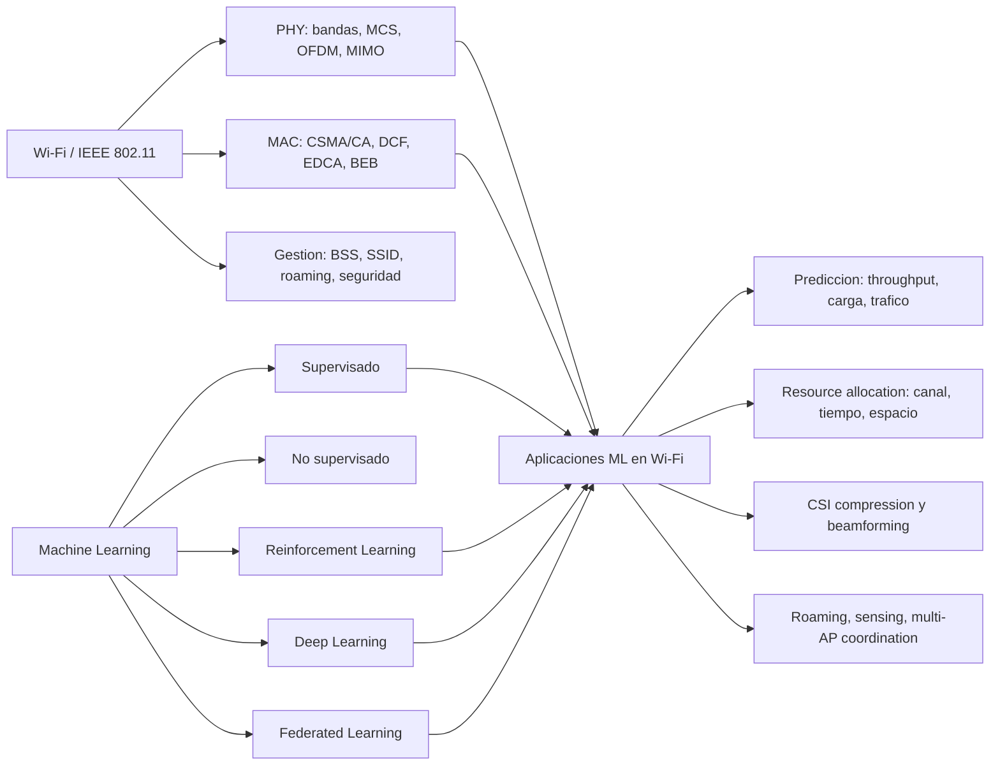

### Ruta de estudio sugerida

| Fase | Temas | Qué debes dominar | Resultado esperado |
|---|---|---|---|
| 1 | Wi-Fi base | PHY, MAC, BSS/SSID, capacidad, CSMA/CA | Poder explicar cómo transmite Wi-Fi y por qué hay colisiones |
| 2 | Workflow ML | tipos de ML, datos, entrenamiento, evaluación | Saber formular un problema de red como ML |
| 3 | RL y bandits | MDP, Q-learning, regret, UCB, Thompson | Elegir entre MAB y RL según el problema |
| 4 | Resource allocation | canal, EDCA, CCA/OBSS-PD, potencia | Entender cómo ML ajusta recursos Wi-Fi |
| 5 | Deep/time series/FL | NN, ARIMA/LSTM/CNN/Transformer, FedAvg | Relacionar modelos con predicción y privacidad |
| 6 | Estándares y recap | AI/ML en Wi-Fi 8, CSI, roaming, OAC | Conectar teoría con evolución real de 802.11 |

### Checklist de dominio

- [ ] Sé explicar la diferencia entre PHY, MAC y management en 802.11.
- [ ] Sé usar la fórmula conceptual de capacidad: streams x bandwidth x log(1 + SNR).
- [ ] Sé describir CSMA/CA, DCF, random backoff, BEB, ACK/ARQ.
- [ ] Sé distinguir supervised, unsupervised y reinforcement learning.
- [ ] Sé construir un pipeline ML completo: adquisición, limpieza, features, normalización, split, diseño, training, evaluación, optimización.
- [ ] Sé definir estado, acción, recompensa, política y Q-value.
- [ ] Sé escribir e interpretar la actualización de Q-learning.
- [ ] Sé explicar exploration vs exploitation y regret.
- [ ] Sé comparar pure exploration, epsilon-greedy, UCB, Thompson y EXP3.
- [ ] Sé formular channel selection como bandit.
- [ ] Sé explicar EDCA: AC, CW, AIFS, TXOP.
- [ ] Sé explicar spatial reuse: CCA, OBSS/PD, potencia y trade-off interferencia/contención.
- [ ] Sé describir forward propagation, backpropagation, loss y optimizers.
- [ ] Sé identificar trend, seasonality, stationarity y differencing en series temporales.
- [ ] Sé explicar FedAvg y los problemas de heterogeneidad/non-IID.
- [ ] Sé citar aplicaciones AI/ML en Wi-Fi: CSI compression, roaming, DRL channel access, MAPC, sensing, OAC.

---

## 1. Introducción: Wi-Fi, ML y convergencia

### 1.1 Qué es Wi-Fi

Wi-Fi es una tecnología de red local inalámbrica, basada en la familia IEEE 802.11, que permite conectar dispositivos como móviles, portátiles, sensores, videoconsolas o equipos industriales a una red local y normalmente a Internet.

En la práctica, Wi-Fi no es solo "la radio". Un sistema Wi-Fi incluye:

- Espectro no licenciado: 2.4 GHz, 5 GHz, 6 GHz y otros casos especiales.
- IEEE 802.11: especificación PHY/MAC.
- Protocolos de capas superiores: IP, DHCP, NAT, DNS, routing, seguridad.
- Funciones de gestión: asociación, autenticación, roaming, beaconing, configuración.
- Ecosistema: IEEE, Wi-Fi Alliance, reguladores, fabricantes, chips, antenas, operadores.

La dificultad de Wi-Fi nace de que opera en espectro no licenciado: cualquier dispositivo compatible puede transmitir, no hay una entidad central universal que reserve recursos, y el entorno cambia constantemente.

### 1.2 Qué define IEEE 802.11

IEEE 802.11 define principalmente:

| Bloque | Ejemplos | Pregunta que responde |
|---|---|---|
| PHY | bandas, modulación, OFDM/OFDMA, MIMO, beamforming | Cómo se transmite físicamente la señal |
| MAC | acceso al canal, fragmentación, retransmisiones, QoS, resource allocation | Cuándo y con qué reglas se transmite |
| Management | asociación, autenticación, roaming, beacons, seguridad | Cómo se crea y mantiene la red |

Conceptos básicos:

- BSS, Basic Service Set: grupo de dispositivos Wi-Fi que pueden comunicarse entre sí.
- BSSID: identificador de un BSS concreto, normalmente asociado a la MAC del AP.
- SSID: nombre humano de la red, por ejemplo `eduroam`.
- AP, Access Point: crea y gestiona el BSS.
- STA, Station: cliente Wi-Fi asociado al AP.

### 1.3 Evolución rápida de Wi-Fi

| Estándar | Generación | Rasgos principales |
|---|---:|---|
| 802.11b | previo a Wi-Fi branding | 2.4 GHz, hasta 11 Mbps, adopción masiva inicial |
| 802.11a/g | - | 54 Mbps, 5 GHz para `a`, 2.4 GHz para `g` |
| 802.11n | Wi-Fi 4 | SU-MIMO, agregación, 2.4/5 GHz |
| 802.11ac | Wi-Fi 5 | MU-MIMO downlink, channel bonding, 5 GHz |
| 802.11ax | Wi-Fi 6/6E | OFDMA, MU-MIMO uplink, eficiencia en redes densas, 5/6 GHz |
| 802.11be | Wi-Fi 7 | Multi-link operation, más streams, canales muy anchos |
| 802.11bn | Wi-Fi 8/UHR | fiabilidad, multi-AP coordination, determinismo, power saving |

### 1.4 Qué es Machine Learning

Machine Learning automatiza la extracción de conocimiento a partir de datos para representar, predecir, clasificar, generar o decidir.

Comparación conceptual:

| Enfoque | Entrada | Proceso | Salida |
|---|---|---|---|
| Programación tradicional | datos + programa escrito por humanos | reglas explícitas | resultado |
| Machine Learning | datos + resultados/feedback | entrenamiento | modelo/programa aprendido |

Usamos ML cuando:

- No conocemos una regla explícita.
- La regla existe pero es demasiado compleja para describirla.
- La regla cambia con el tiempo.
- Hay patrones, anomalías o correlaciones difíciles de programar a mano.

### 1.5 Por qué aplicar ML a Wi-Fi

Wi-Fi tiene muchas decisiones parametrizables:

- Canal, ancho de canal, banda.
- Potencia de transmisión.
- MCS.
- Contention Window.
- CCA/OBSS-PD threshold.
- Asociación a AP.
- Beamforming.
- Roaming.
- Scheduling OFDMA/MU-MIMO.

Y además:

- El entorno cambia: movilidad, paredes, interferencias, congestión.
- La red es densa y parcialmente observable.
- Las decisiones locales pueden afectar a otros BSS.
- Hay trade-offs entre throughput, latencia, fairness, energía y overhead.

Por eso ML puede ayudar en:

- Adaptación a entornos distintos.
- Predicción de carga/tráfico.
- Selección de AP/canal/MCS.
- Reducción de overhead de CSI.
- Gestión de interferencias.
- Sensing con señales Wi-Fi.
- Coordinación multi-AP.

### 1.6 Tabla de enfoques ML en redes

| Paradigma | Algoritmos típicos | Aplicaciones en redes/Wi-Fi | Datos de entrada |
|---|---|---|---|
| Supervised Learning | regresión, SVM, Random Forest, NN, CNN, GNN, Transformers | predicción de tráfico, clasificación de flujos, AP selection, QoE prediction | medidas de canal, KPIs, logs, localización, tráfico |
| Unsupervised Learning | K-means, PCA, autoencoders, HMM, SOM | clustering, anomalías, reducción de dimensión, fingerprinting | RSSI/CSI, matrices de tráfico, símbolos recibidos |
| Reinforcement Learning | Q-learning, SARSA, DQN, actor-critic, MAB | power control, channel selection, rate adaptation, spatial reuse | estado del canal, throughput, delay, colisiones, rewards |

---

## 2. Wi-Fi: fundamentos PHY y MAC

### 2.1 Capacidad de un canal inalámbrico

La asignatura usa una fórmula conceptual:

```text
Capacity = Streams x Bandwidth x log(1 + SNR)
```

Interpretación:

- Streams: número de flujos espaciales simultáneos. Se mejora con MIMO/MU-MIMO.
- Bandwidth: espectro disponible. Se mejora con channel bonding y más subcarriers.
- SNR: calidad de enlace. Se mejora con potencia, beamforming, menos ruido/interferencia, mejor ubicación.

No memorices la fórmula como si fuera una igualdad exacta para todos los casos prácticos. Úsala como mapa mental: la capacidad sube si transmites más streams, si tienes más ancho de banda o si mejora la relación señal-ruido.

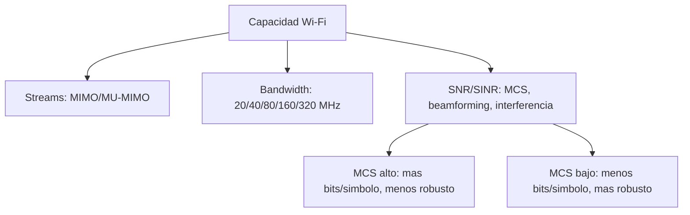

### 2.2 Bandas y canales

Wi-Fi usa espectro no licenciado:

- 2.4 GHz: más alcance, menos ancho disponible, más saturación.
- 5 GHz: más canales y más ancho, menor alcance que 2.4 GHz.
- 6 GHz: más espectro reciente, útil para Wi-Fi 6E/7.
- 60 GHz: tasas muy altas, cobertura corta.
- 860/900 MHz: casos IoT como 802.11ah.

Canales:

- Un canal tiene frecuencia central y ancho.
- Anchos típicos: 20, 40, 80, 160, 320 MHz.
- Mayor ancho puede aumentar throughput, pero también ocupa más espectro y puede aumentar interferencias.

### 2.3 OFDM y OFDMA

OFDM, Orthogonal Frequency Division Multiplexing:

- Divide un canal en subportadoras.
- Las subportadoras transmiten símbolos en paralelo.
- Son ortogonales: el pico espectral de una subportadora coincide con los nulos de las demás, permitiendo empaquetarlas sin interferencia ideal entre ellas.

OFDMA:

- Versión multiusuario de OFDM.
- Asigna grupos de subportadoras, llamados Resource Units, a distintos usuarios.
- Permite que un AP sirva a varios clientes en la misma ventana temporal.

| Técnica | Unidad | Multiusuario | Idea |
|---|---|---|---|
| OFDM | subportadoras para una transmisión | no necesariamente | paralelizar la transmisión de un usuario |
| OFDMA | Resource Units | sí | repartir subportadoras entre usuarios |

### 2.4 Potencia, path loss, SNR y SINR

Potencia de transmisión:

```text
P_tx[dBm] = 10 log10(P_tx[mW])
P_tx[mW] = 10^(P_tx[dBm] / 10)
```

Potencia recibida:

```text
P_rx[dBm] = P_tx[dBm] - PL[dB]
```

Path loss crece con:

- Distancia.
- Frecuencia.
- Obstáculos.
- Entorno: paredes, personas, lluvia, dispersión, reflexión.

SNR:

```text
SNR = señal deseada / ruido
```

SINR:

```text
SINR = señal deseada / (interferencia + ruido)
```

En Wi-Fi importa mucho SINR porque el problema no es solo el ruido térmico, sino otros APs/STAs transmitiendo.

### 2.5 MCS

MCS, Modulation and Coding Scheme, elige modulación y codificación según la calidad del enlace.

| Calidad canal | MCS | Consecuencia |
|---|---|---|
| SNR alto, poca interferencia | alto | más bits por símbolo, mayor throughput, menos robustez |
| SNR bajo, mucha distancia/interferencia | bajo | menos throughput, más robustez |

Ejemplos:

- BPSK: 1 bit por símbolo.
- QPSK: 2 bits por símbolo.
- 16-QAM: 4 bits por símbolo.
- QAMs superiores: más bits, pero necesitan mejor SNR.

### 2.6 Beamforming

Beamforming usa múltiples antenas para concentrar energía hacia una dirección:

- Aumenta SNR del receptor objetivo.
- Reduce interferencia hacia otros dispositivos.
- Permite más simultaneidad espacial.
- Requiere información del canal, normalmente CSI.

El problema: obtener CSI y feedback de beamforming introduce overhead. Por eso aparece CSI compression con autoencoders/ML.

### 2.7 MIMO, SU-MIMO y MU-MIMO

| Técnica | Qué permite | Ejemplo |
|---|---|---|
| SU-MIMO | múltiples streams hacia un usuario | aumentar throughput de un cliente |
| MU-MIMO | streams a varios usuarios | AP transmite/recibe con varios STAs |

Evolución:

- Wi-Fi 5: MU-MIMO downlink.
- Wi-Fi 6: MU-MIMO uplink y downlink.
- Wi-Fi 7: hasta más streams y mejoras de coordinación.

### 2.8 MAC: responsabilidades

La capa MAC en Wi-Fi gestiona:

- Descubrimiento de red: beacons, probe request/response.
- Asociación y autenticación.
- Acceso al medio.
- Retransmisiones y fiabilidad.
- Framing.
- QoS.
- Gestión de energía.
- Movilidad/roaming.

Tipos de tramas:

| Tipo | Uso | Ejemplos |
|---|---|---|
| Management | crear/mantener la red | Beacon, Probe, Authentication, Association |
| Control | coordinar transmisiones | ACK, RTS, CTS |
| Data | transportar datos | tramas de usuario |

### 2.9 DCF, CSMA/CA y random backoff

Wi-Fi usa Distributed Coordination Function como mecanismo base de acceso.

Principios:

- Listen Before Talk: escuchar antes de transmitir.
- Si el canal está ocupado, esperar.
- Si el canal está libre, competir usando backoff aleatorio.
- Si hay colisión, retransmitir.
- Usar ACK para confirmar recepción.

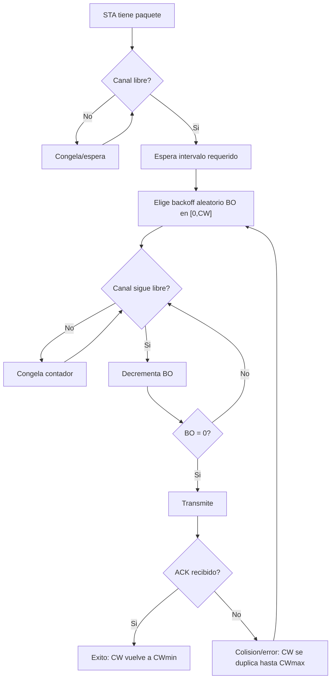

### 2.10 Binary Exponential Backoff

Random backoff:

```text
BO in [0, CW]
E[BO] = CW / 2
```

BEB:

- Al fallar una transmisión, CW se duplica.
- Se limita por un máximo CWmax.
- Tras éxito, CW vuelve a CWmin.

Idea clave: aumentar CW reduce probabilidad de colisión, pero aumenta espera. CW pequeño da acceso agresivo y más colisiones; CW grande reduce colisiones pero aumenta delay y puede desaprovechar el canal.

### 2.11 Mini-resumen Wi-Fi para examen

- Wi-Fi opera en espectro no licenciado: hay contención.
- 802.11 define PHY/MAC/management.
- Capacidad depende de streams, ancho y SNR/SINR.
- OFDM divide el canal en subportadoras; OFDMA reparte subportadoras entre usuarios.
- MCS alto necesita buen SNR.
- DCF = CSMA/CA + backoff aleatorio + BEB + ARQ/ACK.
- EDCA extiende DCF para QoS.

---

## 3. Workflow de Machine Learning aplicado a redes

### 3.1 Tipos de aprendizaje

| Tipo | Datos | Objetivo | Ejemplo Wi-Fi |
|---|---|---|---|
| Supervised Learning | `x` e `y` etiquetada | aprender `f(x)=y` | predecir throughput, clasificar congestión, AP selection |
| Unsupervised Learning | solo `x` | descubrir estructura | clustering de fingerprints RSSI, reducción de CSI |
| Reinforcement Learning | estados, acciones, rewards | aprender una política | channel selection, MCS selection, power control |

### 3.2 Tipos de tareas

Clasificación:

- Binaria: congestión sí/no.
- Multiclase: tipo de aplicación o clase de tráfico.
- Multietiqueta: varias categorías por muestra.

Regresión:

- Predecir valores continuos: throughput, delay, carga, RSSI futuro.
- Puede ser lineal, polinómica o no lineal.

Forecasting:

- Predicción temporal de valores futuros.
- Ejemplo: carga por AP durante la próxima hora.

Decisión secuencial:

- Elegir acciones repetidas bajo incertidumbre.
- Ejemplo: cambiar canal, ajustar CCA, elegir MCS.

### 3.3 Workflow completo

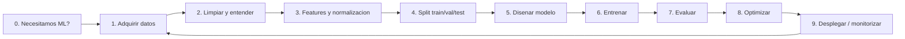

Pregunta cero: "¿Hace falta ML?". Una heurística simple puede bastar. Si un modelo complejo no mejora claramente al baseline, el coste extra no se justifica.

### 3.4 Formulación del problema

Antes de entrenar, define:

- Paradigma: supervisado, no supervisado, RL.
- Tipo de tarea: clasificación, regresión, forecasting, control.
- Inference approach:
  - Batch: predicciones offline en ventanas, por ejemplo cada 10 minutos.
  - Online: inferencia en tiempo real, por ejemplo detección de intrusiones.
- Datos:
  - Features disponibles.
  - Labels si aplica.
  - Forma/tamaño de entrada.
- Métrica:
  - MSE, MAE, accuracy, precision, recall, F1.
  - Métricas de red: throughput, delay, packet loss, airtime, fairness.
- Restricciones:
  - Latencia de inferencia.
  - Energía.
  - Memoria.
  - Privacidad.
  - Overhead de señalización.

Ejemplo:

| Elemento | Decisión |
|---|---|
| Problema | predecir rendimiento Wi-Fi |
| Tipo | regresión |
| Inference | batch cada 10 min |
| Datos | throughput, latencia, canal, RSSI, configuración |
| Métrica ML | MSE throughput normalizado |
| Métrica de red | throughput/delay |

### 3.5 Adquisición de datos

Fuentes típicas:

- Equipos de red: routers, switches, firewalls, APs.
- SNMP, CLI, logs de gestión.
- Capturas de paquetes: Wireshark, monitor mode.
- Flujos: NetFlow.
- Aplicaciones: RTT, retransmisiones, bitrate, logs.
- Sensores RF: spectrum analyzer, SDR.
- Simuladores: ns-3, OMNET++, Komondor.
- Modelos matemáticos: Bianchi para DCF, path loss, Markov chains.
- Testbeds: OpenWRT, Octobox, hardware real.
- Despliegues reales: campus, hospitales, estadios, hotspots.

### 3.6 Pros y contras de fuentes de datos

| Fuente | Ventajas | Inconvenientes |
|---|---|---|
| Despliegues reales | realismo, muchos datos, problemas reales | acceso difícil, privacidad, poco control |
| Testbeds | control, reproducibilidad, hardware real | alcance limitado |
| Simuladores/emuladores | baratos, flexibles, prototipado rápido | fidelidad limitada |
| Modelos matemáticos | generalizables, buenos para intuición | supuestos fuertes, poca implementación |

### 3.7 Limpieza de datos

Problemas habituales:

- Missing values.
- Outliers.
- Ruido.
- Timestamps desalineados.
- Formatos heterogéneos.
- Errores de medición.

Técnicas:

- Interpolación.
- Zero-padding para paquetes CSI faltantes.
- Filtros: moving average, Kalman.
- Outlier detection:
  - Z-score.
  - IQR.
  - Boxplots.
  - DBSCAN.
  - Isolation Forest.
  - KNN.

### 3.8 Feature engineering

El modelo puede no aprender fácilmente transformaciones complejas desde datos crudos.

Ejemplos:

- FFT para pasar de dominio temporal a frecuencial.
- RSSI categórico: good/medium/poor.
- Kurtosis/skewness para detectar NLoS.
- Channel occupancy ratio.
- Head-of-Line delay.
- Estadísticos por ventana: media, varianza, percentiles.
- Features de calendario para tráfico: hora, día de semana.

### 3.9 Normalización

Min-Max:

```text
x' = (x - min(x)) / (max(x) - min(x))
```

Z-score:

```text
x' = (x - mu) / sigma
```

Decimal scaling:

```text
x' = x / 10^k
```

Por qué importa:

- Evita que una feature domine por escala.
- Mejora convergencia.
- Es especialmente importante para redes neuronales, SVM y métodos basados en distancia.

### 3.10 Partición de datos

Partición típica:

- Train: 70-80%.
- Validation: 10-20%.
- Test: 10-20%.

Métodos:

- Random: si los datos son i.i.d.
- Stratified: si hay clases y quieres balance.
- Chronological: para series temporales.
- K-fold cross-validation.
- Leave-One-Out.
- Bootstrapping.

Regla crítica: el test set se usa al final. Si ajustas hiperparámetros mirando test, contaminas la evaluación.

### 3.11 Diseño del modelo

Arquitecturas según datos:

| Datos/problema | Modelo razonable |
|---|---|
| Tabular simple | regresión lineal, Random Forest, MLP |
| Imagen/radio map | CNN |
| Serie temporal | ARIMA, RNN, GRU, LSTM, Transformer |
| Topología/grafo/interferencias | GNN |
| Decisiones secuenciales | RL, MAB |
| Compresión | Autoencoder |

Trade-offs:

- Accuracy vs latency.
- Generalization vs specialization.
- Complexity vs energy.
- Interpretability vs performance.
- Centralized vs distributed/federated.

### 3.12 Entrenamiento

Ingredientes:

- Epochs.
- Batch size.
- Loss.
- Optimizer.
- Learning rate.
- Validación.
- Early stopping.

Loss comunes:

| Tarea | Loss |
|---|---|
| Regresión | MSE, MAE, RMSE |
| Clasificación binaria | Binary Cross-Entropy |
| Clasificación multiclase | Cross-Entropy |
| Reconstrucción | MSE, MAE, PSNR |

### 3.13 Evaluación

Métricas de clasificación:

- Accuracy.
- Precision.
- Recall.
- F1-score.

Métricas de regresión:

- MSE.
- RMSE.
- MAE.
- MAPE.

Métricas de reconstrucción:

- MSE.
- PSNR.

Métricas de redes:

- Throughput.
- Delay.
- Jitter.
- Packet loss.
- Airtime.
- Fairness.
- Energy consumption.

### 3.14 Underfitting y overfitting

Underfitting:

- Modelo demasiado simple.
- Error alto en train y test.
- No aprende patrones.

Overfitting:

- Modelo memoriza training.
- Error bajo en train, alto en test.
- Mala generalización.

Mitigación:

- Más datos.
- Regularización.
- Dropout.
- Early stopping.
- Modelo más simple.
- Data augmentation.
- Validación correcta.

### 3.15 Optimización del modelo

Técnicas:

- Quantization: menor precisión, por ejemplo 8 bits.
- Pruning: eliminar pesos/conexiones poco útiles.
- Weight clustering: agrupar pesos similares.
- Distillation: entrenar un modelo pequeño a partir de uno grande.

En redes importa mucho porque el modelo puede ejecutarse en APs, STAs o dispositivos IoT con energía y memoria limitadas.

---

## 4. Data collection en redes

### 4.1 Tipos de datos de red

| Tipo | Ejemplos |
|---|---|
| Topología | nodos, enlaces, conexiones |
| Atributos | ubicación, capacidades 802.11, peso de enlaces |
| Configuración | rutas, RRM, IPs, canales, potencia |
| Performance | throughput, delay, load, utilization, errores |
| Eventos | fallos, cortes, alertas, cambios de ruta |
| Clientes | perfiles, planes, CRM/KYC si aplica |
| Radio | RSSI, CSI, path loss, spectrum power |

### 4.2 Herramientas

Wireshark:

- Captura paquetes.
- Permite monitor mode para Wi-Fi.
- Extrae RSSI, tramas, retransmisiones, estadísticas.

iperf:

- Genera tráfico TCP/UDP.
- Parámetros: bandwidth, duración, destino.
- Sirve para medir throughput bajo condiciones controladas.

Scapy:

- Crear, enviar y analizar paquetes desde Python.

SNMP:

- Consultar estado de dispositivos.
- CPU, memoria, errores, bytes TX/RX.

NetFlow:

- Flujos, patrones de tráfico, ancho consumido.

Spectrum analyzer / SDR:

- Medir potencia por frecuencia.
- Observar ocupación de canales.

Komondor:

- Simulador IEEE 802.11ax.
- Útil para datasets grandes y experimentación RL.

### 4.3 Datos reales vs sintéticos

Los datos sintéticos son útiles cuando:

- Hay privacidad sensible.
- No se puede acceder a despliegues reales.
- Se necesita controlar variables.
- Se quiere generar escenarios raros.

Pero cuidado:

- El modelo puede aprender artefactos del simulador.
- Puede haber mismatch con la realidad.
- Hay que validar con datos reales si el resultado se va a desplegar.

### 4.4 Problemas prácticos al recolectar datos

- Escala: almacenamiento y procesamiento.
- Calidad: ruido, pérdidas, errores.
- Integración: formatos distintos.
- Dinamismo: topología y tráfico cambian.
- Privacidad: GDPR, datos personales, trazas sensibles.
- Seguridad: logs y payload pueden revelar información.

### 4.5 Use cases del temario

Medición Wi-Fi:

- Captura de paquetes.
- RSSI, ruido, interferencia.
- Throughput/delay a partir de iperf o tramas.

Spectrum sensing:

- Analizadores como Aaronia.
- WACA para analizar 5 GHz completo.

Simulación:

- Komondor para escenarios densos 802.11ax.

LTE data collection:

- Captura PDCCH cada TTI = 1 ms.
- Variables: C-RNTI, MCS, RBs, HARQ ID, TBS.
- Útil para predicción de tráfico y federated learning.

---

## 5. Reinforcement Learning y Multi-Armed Bandits

### 5.1 Intuición RL

Reinforcement Learning aprende por interacción:

1. Un agente observa el estado.
2. Toma una acción.
3. El entorno responde.
4. Recibe reward.
5. Actualiza su estrategia.

Objetivo: encontrar una política que maximice recompensa acumulada.

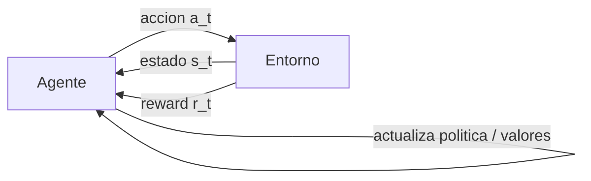

Ejemplos en wireless:

- Channel allocation.
- Power control.
- Spectrum access.
- MCS selection.
- Spatial reuse.
- Routing.

### 5.2 Componentes

| Concepto | Símbolo | Definición | Ejemplo Wi-Fi |
|---|---|---|---|
| State | `s` | situación observada | SINR, PER, canal ocupado/libre |
| Action | `a` | decisión | elegir MCS, canal, potencia |
| Reward | `r` | feedback | throughput, delay negativo, airtime |
| Policy | `pi` | estrategia estado -> acción | elegir MCS más prometedor |
| Value | `V(s)` | valor esperado de un estado | utilidad de estar en canal libre |
| Q-value | `Q(s,a)` | valor esperado de acción en estado | utilidad de MCS 7 con SINR 25 dB |

### 5.3 MDP

Un Markov Decision Process se define por:

- `S`: conjunto de estados.
- `A`: conjunto de acciones.
- `P(s'|s,a)`: probabilidad de transición.
- `R(s,a,s')`: recompensa.

Propiedad de Markov: el futuro depende del estado actual, no de toda la historia. En redes reales esto es una aproximación; a veces el "estado" debe incluir historial para ser útil.

### 5.4 Value Iteration y Policy Iteration

Value Iteration:

```text
V_{t+1}(s) = max_a [ R(s,a) + gamma * sum_{s'} P(s'|s,a) V_t(s') ]
```

Después:

```text
pi*(s) = argmax_a [ R(s,a) + gamma * sum_{s'} P(s'|s,a) V*(s') ]
```

Policy Iteration:

1. Evalúa una política fija.
2. Mejora la política eligiendo mejores acciones.
3. Repite hasta converger.

Diferencia clave:

- Model-based: aprende o conoce `P` y `R`.
- Model-free: aprende directamente de experiencia sin modelar transiciones.

### 5.5 Q-learning

Q-learning es:

- Model-free.
- Value-based.
- Off-policy.

Actualización:

```text
Q(s_t,a_t) <- Q(s_t,a_t) + alpha * [ r_t + gamma * max_a Q(s_{t+1},a) - Q(s_t,a_t) ]
```

Interpretación:

- `Q(s_t,a_t)`: lo que creía antes.
- `r_t`: recompensa inmediata.
- `gamma * max Q(s_{t+1},a)`: mejor futuro estimado.
- El corchete es el temporal difference error.
- `alpha` controla cuánto actualizo.

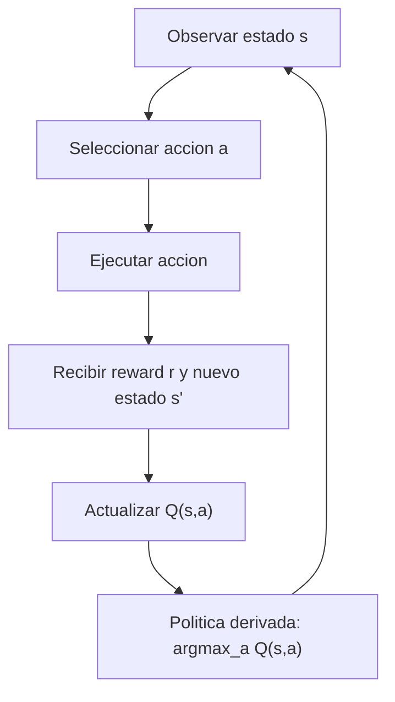

### 5.6 Ejemplo: rate control inteligente

Problema: el AP elige el MCS según la calidad reciente.

Formulación:

- Estado: `(SINR, PER)`.
- Acción: MCS `a in {0,1,...,7}`.
- Reward:

```text
R(s,a) = DataRate(a) * (1 - PER_a)
```

Flujo:

1. AP mide SINR.
2. Selecciona MCS con epsilon-greedy.
3. Transmite.
4. Observa ACKs y calcula PER.
5. Actualiza Q-table.

Problema práctico: SINR es continuo. Soluciones:

- Discretizar: buckets de 1 dB o rangos poor/medium/good.
- Deep Q-Network: red neuronal aproxima `Q(s,a; theta)`.
- Policy gradients: para acciones continuas.

### 5.7 Online vs offline RL

Offline:

- Entrena con dataset fijo.
- Útil si interactuar es caro o peligroso.
- Riesgo: el dataset no cubre acciones nuevas.

Online:

- Aprende interactuando.
- Se adapta continuamente.
- Riesgo: exploración puede degradar la red real.

En Wi-Fi real, online learning debe controlar muy bien el coste de explorar.

---

## 6. Multi-Armed Bandits

### 6.1 Qué es un MAB

Un Multi-Armed Bandit modela decisiones repetidas entre `K` acciones/brazos con feedback parcial.

Ejemplo clásico: máquinas tragaperras. Ejemplo Wi-Fi: elegir canal.

En cada iteración:

- Eliges un brazo.
- Observas solo su reward.
- No sabes qué habría pasado con los otros.

Trade-off central:

- Exploration: probar para aprender.
- Exploitation: usar lo que parece mejor.

### 6.2 MAB vs RL completo

| Caso | MAB | RL |
|---|---|---|
| Hay estado complejo | limitado o contextual | sí |
| La acción cambia el estado futuro | normalmente no modelado | sí |
| Feedback | reward del brazo elegido | reward + transición |
| Ejemplo | channel selection con ocupación observada | MCS/power control con evolución del enlace |

Si el problema es "elige entre opciones y observa recompensa" sin dinámica de estado rica, MAB suele bastar. Si hay estados y transiciones, RL.

### 6.3 Tipos de MAB

Stochastic:

- Cada brazo tiene distribución de recompensa fija.
- Bernoulli, Gaussian u otra.

Adversarial:

- No se asume distribución.
- El entorno puede cambiar de forma hostil.

Markovian:

- Cada brazo tiene estados internos.
- Rested: solo cambia al jugarlo.
- Restless: cambia aunque no lo juegues.

Otros:

- Contextual bandits.
- Continuum-armed bandits.
- Combinatorial bandits.
- Sleeping/mortal bandits.
- Multiple plays.
- Dueling bandits.

### 6.4 Notación y regret

| Símbolo | Significado |
|---|---|
| `K` | número de brazos |
| `r(t)` | recompensa instantánea |
| `mu_i` | reward medio real del brazo `i` |
| `mu*` | reward medio del brazo óptimo |
| `S(T)` | recompensa acumulada |
| `R(T)` | regret acumulado |
| `T` | horizonte temporal |

Recompensa acumulada:

```text
S(T) = sum_{t=1}^T r(t)
```

Reward medio:

```text
S_bar(T) = (1/T) sum_{t=1}^T r(t)
```

Regret:

```text
R(T) = sum_{t=1}^T (mu* - r(t))
```

El regret mide lo que pierdes respecto a un oráculo que siempre elige el mejor brazo.

### 6.5 Pure exploration

Idea:

1. Probar cada brazo `N` veces.
2. Estimar media.
3. Explotar el mejor hasta el final.

Ventaja:

- Simple.

Problema:

- Si exploras poco, eliges mal.
- Si exploras demasiado, pierdes tiempo.

### 6.6 Epsilon-greedy

En cada paso:

- Con probabilidad `epsilon`: explorar al azar.
- Con probabilidad `1 - epsilon`: explotar el mejor estimado.

Pseudocódigo:

```text
for t = 1..T:
    p ~ Uniform(0,1)
    if p < epsilon:
        i ~ Uniform(K)
    else:
        i = argmax_i mu_hat_i
    observe r_i
    update mu_hat_i
```

Si `epsilon` es constante, el regret tiene una parte lineal porque siempre sigues explorando. Para regret sublineal, `epsilon` debe decrecer:

```text
epsilon_t = epsilon_0 / t
```

o

```text
epsilon_t = epsilon_0 / sqrt(t)
```

### 6.7 UCB

Upper Confidence Bound elige:

```text
UCB_i = mu_hat_i + sqrt(2 ln(t) / N_i)
i = argmax_i UCB_i
```

La primera parte explota; la segunda explora brazos con incertidumbre.

Intuición:

- Si un brazo fue poco probado, `N_i` es pequeño y el bonus sube.
- Si un brazo fue muy probado, el bonus baja.

UCB es "optimista": prueba acciones que podrían ser buenas dada la incertidumbre.

### 6.8 Thompson Sampling

Thompson Sampling mantiene una distribución de creencia sobre cada brazo.

Proceso:

1. Muestrea un valor probable para cada brazo.
2. Elige el brazo con mayor muestra.
3. Observa reward.
4. Actualiza la distribución.

Ventaja:

- Simple y con buen rendimiento práctico.
- Equilibra exploración y explotación de forma natural.

### 6.9 EXP3

EXP3 se usa para bandits adversariales.

Idea:

- Mantener pesos por brazo.
- Convertir pesos en probabilidades.
- Elegir al azar según esas probabilidades.
- Reponderar usando reward estimado.

Útil cuando no puedes asumir recompensas i.i.d. ni estacionarias.

### 6.10 Tabla comparativa

| Algoritmo | Explora cómo | Mejor contexto | Riesgo |
|---|---|---|---|
| Pure exploration | fase fija inicial | horizonte claro, pruebas baratas | presupuesto mal elegido |
| Epsilon-greedy | probabilidad aleatoria | baseline sencillo | regret lineal si epsilon constante |
| UCB | bonus de incertidumbre | stochastic bandits | asume estructura estadística |
| Thompson | muestreo bayesiano | buen rendimiento general | requiere prior/modelo |
| EXP3 | aleatorización ponderada | adversarial | puede ser conservador |

---

## 7. Resource allocation en Wi-Fi mediante RL

### 7.1 Qué es resource allocation

En Wi-Fi, los recursos principales son:

- Frecuencia: canales, ancho, RUs.
- Tiempo: airtime, TXOP, backoff.
- Espacio: MIMO, beamforming, spatial reuse.

Objetivos:

- Throughput.
- Delay.
- Fairness.
- Efficiency.
- QoS.
- Energy saving.

### 7.2 Por qué hace falta AI/ML

Por tres razones:

1. Incertidumbre:
   - medio compartido;
   - colisiones;
   - interferencia;
   - movilidad.

2. Complejidad:
   - muchas features: MU-MIMO, OFDMA, MLO, channel bonding;
   - muchas combinaciones de parámetros.

3. Fairness y compatibilidad:
   - dispositivos antiguos;
   - intereses locales vs rendimiento global.

### 7.3 Formas de ganar/usar recursos

| Mecanismo | Idea | Decisión de resource allocation |
|---|---|---|
| DCF | contención distribuida | CW, backoff |
| PCF | AP coordina acceso | permisos centralizados |
| HCF/EDCA | QoS en 802.11e | prioridades por AC |
| MU-MIMO | streams espaciales | pairing de STAs y streams |
| OFDMA | Resource Units | tamaño/asignación de RUs |
| TXOP sharing | compartir oportunidad ganada | con qué STAs se comparte |

### 7.4 Channel selection como bandit

Problema:

- AP debe elegir canal `i in {1,...,N}`.
- Reward basado en ocupación del canal:

```text
r = 1 - rho(c)
```

donde `rho(c)` representa fracción de tiempo ocupado.

Feedback:

- El AP solo observa el canal que usa.
- No sabe qué pasa en todos los canales.
- Esto es bandit feedback.

Algoritmos aplicables:

- Pure exploration.
- Epsilon-greedy.
- UCB.
- Thompson Sampling.

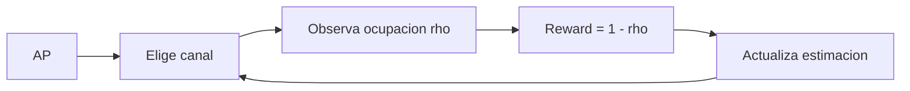

### 7.5 Channel selection con Q-learning

Formulación:

- Iteraciones como slots.
- Estado: canal idle/busy.
- Acción: elegir canal o decisión de transmisión.
- Reward: throughput, éxito, baja ocupación o bajo delay.
- Política: epsilon-greedy.

La diferencia respecto a MAB es que Q-learning modela estado y valor futuro, no solo media de cada canal.

### 7.6 EDCA

Enhanced Distributed Channel Access da QoS mediante Access Categories:

| AC | Tráfico | Prioridad típica |
|---|---|---|
| AC_VO | voice | alta |
| AC_VI | video | alta/media |
| AC_BE | best effort | media |
| AC_BK | background | baja |

EDCA modifica el acceso al canal con:

- CWmin/CWmax.
- AIFS/AIFSN.
- TXOP limit.

### 7.7 Contention Window en EDCA

CW controla el rango del backoff:

```text
BO in [0, CW]
E[BO] = CW / 2
```

Ejemplo de prioridades:

- AC_VO/AC_VI: CWmin menor, acceso más rápido.
- AC_BE: CWmin intermedio.
- AC_BK: CWmin mayor, espera más.

Trade-off:

- CW bajo: menos delay, más riesgo de colisión/agresividad.
- CW alto: menos colisión, más espera.

### 7.8 AIFS

AIFS es el intervalo que una categoría espera antes de empezar backoff.

- AIFS bajo: empieza antes a decrementar contador.
- AIFS alto: cede prioridad.

EDCA combina CW y AIFS para dar prioridad real a voz/vídeo.

### 7.9 TXOP

TXOP limit define cuánto tiempo puede ocupar el canal una estación cuando gana.

Impacto:

- TXOP alto: más airtime para esa categoría.
- TXOP bajo: limita ocupación.

Ejemplo del temario:

- Video y voz con TXOP altos y CW bajos pueden obtener la gran mayoría del airtime.
- Best effort y background quedan con menor airtime.

### 7.10 Spatial reuse

Spatial reuse intenta permitir transmisiones simultáneas si no se interfieren demasiado.

Conceptos:

- CCA: Clear Channel Assessment.
- ED threshold: detecta señales no Wi-Fi, típico -62 dBm.
- SD threshold: detecta Wi-Fi, típico -82 dBm.
- OBSS/PD: umbral más relajado para BSS solapados.

Idea:

- Umbral más alto: el nodo considera el canal libre con más facilidad.
- Umbral más bajo: el nodo es más conservador.

| Configuración | Efecto positivo | Efecto negativo |
|---|---|---|
| CCA/SD alto | menos contención, más transmisiones simultáneas | más interferencia |
| CCA/SD bajo | menos interferencia | más contención, menos simultaneidad |

### 7.11 Potencia de transmisión

Subir potencia:

- Mejora señal recibida.
- Puede permitir MCS mayor.
- Aumenta cobertura.

Pero:

- Causa más interferencia.
- Aumenta área de contención.
- Puede reducir capacidad global en redes densas.

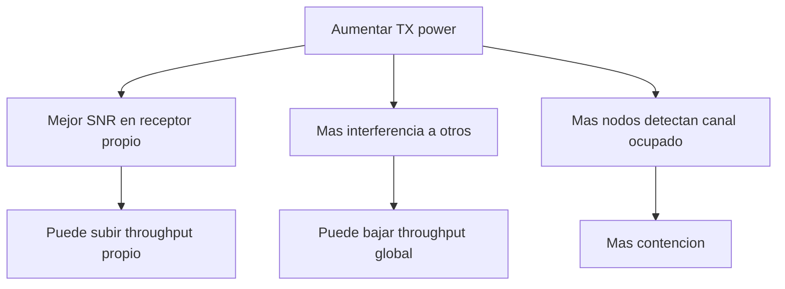

### 7.12 RL para spatial reuse

Formulación:

- Acción: elegir par `(CCA/SD, TX power)`, por ejemplo:
  - `(-82 dBm, 20 dBm)`;
  - `(-72 dBm, 10 dBm)`;
  - `(-62 dBm, 5 dBm)`.
- Reward: throughput, delay, airtime, TXOPs, fairness.
- Estado: medidas de interferencia, RSSI, ocupación, colisiones.

Problema multiagente:

- Si cada AP maximiza reward propio, el entorno se vuelve no estacionario.
- Puede aparecer Nash subóptimo: todos transmiten agresivamente.
- Resultado: interferencia alta y rendimiento global bajo.

### 7.13 Reward compartido

Para coordinar APs, puede definirse reward compartido:

Average:

```text
r_AVG = (1/|P|) sum_p r(p)
```

Max-min:

```text
r_MAXMIN = min_p r(p)
```

Proportional fairness:

```text
r_PF = sum_p log(r(p))
```

Interpretación:

| Reward | Favorece |
|---|---|
| AVG | rendimiento medio |
| MAX-MIN | usuario/AP peor situado |
| PF | equilibrio entre eficiencia y fairness |

---

## 8. Redes neuronales y Deep Learning

### 8.1 Idea central

Una red neuronal aprende una función compleja combinando capas.

- Capas iniciales: patrones simples.
- Capas profundas: patrones más abstractos.
- DNN: muchas hidden layers.

Tipos:

- FNN/MLP.
- CNN.
- RNN.
- Autoencoders.
- GANs.
- Transformers.

### 8.2 Perceptrón

Modelo:

```text
y = h( sum_i x_i w_i + b )
```

Componentes:

- Inputs `x_i`.
- Pesos `w_i`.
- Bias `b`.
- Activación `h`.

Un perceptrón simple separa clases linealmente. XOR no puede resolverse con un único perceptrón porque no es linealmente separable; necesita múltiples capas.

### 8.3 Arquitectura general

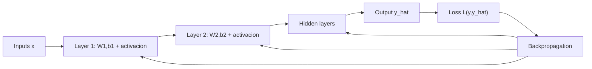

### 8.4 Pasos de entrenamiento

1. Preparar datos:
   - clean;
   - normalize/standardize;
   - split train/validation/test.

2. Inicializar pesos:
   - zero initialization, mala para simetrías;
   - random;
   - Xavier/Glorot;
   - He.

3. Forward propagation:

```text
z^(l) = W^(l) a^(l-1) + b^(l)
a^(l) = sigma(z^(l))
```

4. Calcular loss.

5. Backpropagation:
   - estimar gradientes;
   - actualizar pesos con optimizer.

6. Repetir por epochs/batches.

7. Evaluar en test.

### 8.5 Activaciones

Sigmoid:

```text
sigma(x) = 1 / (1 + e^-x)
```

Tanh:

```text
tanh(x) = (e^x - e^-x) / (e^x + e^-x)
```

ReLU:

```text
f(x) = max(0,x)
```

Softmax:

```text
S_i(z) = e^{z_i} / sum_j e^{z_j}
```

Uso típico:

| Activación | Uso |
|---|---|
| ReLU | hidden layers |
| Sigmoid | salida binaria |
| Softmax | salida multiclase |
| Tanh | RNN/representaciones centradas |

### 8.6 Loss functions

MSE:

```text
MSE = (1/n) sum_i (y_i - y_hat_i)^2
```

MAE:

```text
MAE = (1/n) sum_i |y_i - y_hat_i|
```

MAPE:

```text
MAPE = (1/n) sum_i |(y_i - y_hat_i)/y_i| * 100%
```

Binary Cross-Entropy:

```text
BCE = -(1/n) sum_i [ y_i log(y_hat_i) + (1-y_i) log(1-y_hat_i) ]
```

### 8.7 Optimizers

| Optimizer | Idea |
|---|---|
| GD | usa todo el dataset para gradiente |
| SGD | actualiza con muestras/batches |
| AdaGrad | adapta learning rate por parámetro |
| RMSprop | suaviza gradientes recientes |
| Adam | combina momentos de primer y segundo orden |

Learning rate:

- Muy alto: inestabilidad.
- Muy bajo: entrenamiento lento.
- Scheduler puede ayudar.

### 8.8 Vanishing gradient

Problema:

- En redes profundas, gradientes pueden hacerse muy pequeños al retropropagarse.
- Capas tempranas dejan de aprender.
- Suele ocurrir con activaciones saturantes como sigmoid/tanh.

Mitigación:

- ReLU.
- Inicialización adecuada.
- Normalización.
- Arquitecturas con gates/residual connections.
- LSTM/GRU en secuencias.

### 8.9 Dropout

Dropout regulariza:

- Durante training, pone a cero aleatoriamente una fracción de activaciones.
- Fuerza a aprender features más robustas.
- Reduce dependencia excesiva entre neuronas.

No es lo mismo que:

- L2 regularization.
- Early stopping.
- Bajar learning rate.

### 8.10 Autoencoders

Autoencoder:

- Encoder comprime.
- Bottleneck o latent space representa información compacta.
- Decoder reconstruye.

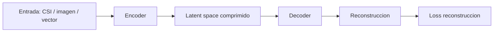

Aplicación:

- CSI feedback compression.
- Reducir overhead de sounding.
- Mantener calidad suficiente para beamforming.

Métricas:

- MSE de reconstrucción.
- PSNR.
- Impacto final en beamforming/throughput.

### 8.11 Ejemplo: predicción de rendimiento Wi-Fi con NN

Features posibles:

- Location number.
- RSSI.
- TxLinkSpeed.
- RxLinkSpeed.
- MainAPConnect.
- Número de STAs.
- Load.
- Channel width.
- CW.
- Packet size.

Labels:

- Throughput.
- Delay.
- Congestión.

Modelo:

- MLP para tabular.
- CNN si hay mapas/radio maps.
- RNN/LSTM si hay secuencia temporal.

---

## 9. Series temporales y forecasting en redes inalámbricas

### 9.1 Qué es una serie temporal

Serie temporal: secuencia de datos indexados por tiempo.

Forecasting: predecir valores futuros usando histórico.

Componentes:

- Trend: crecimiento/decrecimiento a largo plazo.
- Seasonality: patrón repetitivo fijo, por ejemplo diario.
- Cyclicity: patrón repetitivo irregular.
- Irregularity/noise: fluctuación aleatoria.

### 9.2 Stationarity

Una serie estacionaria mantiene propiedades estadísticas en el tiempo:

- Media constante.
- Varianza constante.
- Autocovarianza dependiente solo del lag.

Stationarity débil:

```text
E[X_t] = mu
Var(X_t) = sigma^2
Cov(X_t, X_{t-h}) = gamma(h)
```

Muchos modelos clásicos como ARIMA asumen estacionariedad o requieren diferenciar la serie.

### 9.3 Cómo evaluar stationarity

Visual:

- Plot temporal.
- ACF: autocorrelation function.
- PACF: partial autocorrelation function.

Tests:

- ADF, Augmented Dickey-Fuller.
- KPSS.

Regla práctica:

- Si hay trend/seasonality/cambio de varianza, sospecha no estacionariedad.
- Si ACF decae lentamente, sospecha no estacionariedad.

### 9.4 Trends

Lineal:

```text
Y_t = beta_0 + beta_1 t + epsilon_t
```

Cuadrática:

```text
Y_t = beta_0 + beta_1 t + beta_2 t^2 + epsilon_t
```

Exponencial:

```text
Y_t = beta_0 e^{beta_1 t} epsilon_t
ln(Y_t) = ln(beta_0) + beta_1 t + ln(epsilon_t)
```

### 9.5 Eliminar trend

Moving average:

```text
Ybar_t = (1/k) sum_{i=0}^{k-1} Y_{t-i}
```

Differencing:

```text
Delta Y_t = Y_t - Y_{t-1}
```

Segunda diferencia:

```text
Delta^2 Y_t = (Y_t - Y_{t-1}) - (Y_{t-1} - Y_{t-2})
```

### 9.6 Rolling forecast origin

Para forecasting:

- Usas una ventana de `N` slots pasados.
- Predices `M` slots futuros.

Tipos:

- One-step: `M = 1`.
- Multi-step: `M > 1`.
- Multi-step recursivo: predicciones alimentan predicciones futuras.

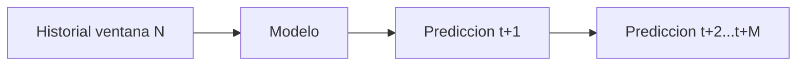

### 9.7 ARIMA

ARIMA = AutoRegressive Integrated Moving Average.

Componentes:

- AR (`p`): usa observaciones pasadas.
- I (`d`): differencing para estacionarizar.
- MA (`q`): usa errores pasados.

Notación:

```text
ARIMA(p,d,q)
```

Útil cuando:

- Serie estacionaria o estacionarizable.
- Forecast corto.
- Importa interpretabilidad.
- Dataset no enorme.

### 9.8 RNN, GRU y LSTM

RNN:

- Diseñada para secuencias.
- Mantiene estado oculto.
- Puede sufrir vanishing gradient.

GRU:

- Usa update gate y reset gate.
- Menos compleja que LSTM.
- Entrena más rápido.

LSTM:

- Usa input, forget y output gates.
- Maneja dependencias largas.
- Más costosa y menos escalable.

Uso en redes:

- Predicción de tráfico.
- Carga de AP.
- Patrones de movilidad.

### 9.9 CNN para series temporales

Una CNN puede extraer patrones locales:

- Convoluciones detectan formas en ventanas.
- Pooling reduce dimensión.
- Puede combinarse con LSTM.

Elementos:

- Convolutional layer.
- Activation.
- Pooling.
- Fully connected.

Pros:

- Buena extracción local.
- Paralelizable.

Contras:

- Requiere datos.
- Puede ser costosa.
- Puede no capturar dependencias largas sin diseño adecuado.

### 9.10 Transformer

Transformers usan attention:

- Self-attention.
- Multi-head attention.
- Positional encoding.
- Feed-forward layers.

Ventajas:

- Capturan dependencias largas.
- Muy potentes para secuencias complejas.

Costes:

- Computación alta.
- Memoria alta.
- Necesidad de muchos datos.

### 9.11 Selección de modelo para forecasting

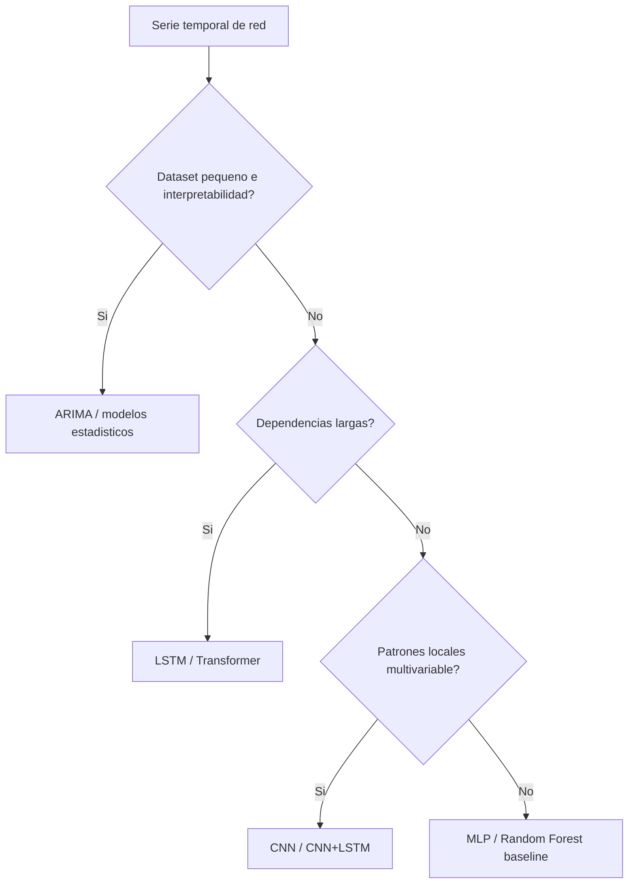

### 9.12 Aplicación: Wi-Fi AP load prediction

Objetivo:

- Predecir carga futura por AP.
- Horizontes: próxima hora, 24h, etc.

Aplicaciones:

- Detectar hot/cold spots.
- Optimizar configuración de AP.
- Reducir troubleshooting.
- Power saving dinámico.
- Resource allocation inteligente.
- Roaming consciente de carga.

Granularidad:

- 1 hora: menos muestras, menor coste.
- 1 minuto: muchas muestras, más detalle, mayor coste.

Ejemplo del temario para 16 APs:

| Granularidad | Muestras |
|---|---:|
| 1 hora | 6.078 |
| 10 min | 36.788 |
| 5 min | 66.967 |
| 2 min | 167.516 |
| 1 min | 368.465 |

Mayor granularidad temporal no siempre significa mejor modelo: puede introducir ruido, coste y necesidad de mayor capacidad.

---

## 10. Federated Learning

### 10.1 Definición

Federated Learning entrena modelos con datasets descentralizados:

- Los datos permanecen en clientes.
- Se envían updates del modelo, no datos crudos.
- Un servidor central agrega actualizaciones.

Objetivo:

- Aprender un modelo global.
- Reducir riesgos de privacidad.
- Aprovechar cómputo distribuido.

### 10.2 Centralized vs Federated

| Aspecto | Centralized Learning | Federated Learning |
|---|---|---|
| Datos | se recopilan en servidor | se quedan en clientes |
| Entrenamiento | un modelo central | modelos locales + agregación |
| Privacidad | más riesgo | menor exposición de datos crudos |
| Comunicación | subir datos | subir updates |
| Problemas | escalabilidad, seguridad | non-IID, staleness, clientes offline |

### 10.3 FedAvg

Proceso:

1. Servidor envía modelo global `omega(t)` a clientes seleccionados.
2. Cada cliente entrena localmente con sus datos `D_k`.
3. El cliente produce modelo/update `omega_k(t)`.
4. Envía update al servidor.
5. Servidor agrega y crea `omega(t+1)`.

Objetivo:

```text
min_omega F(omega) = sum_{k=1}^K (|D_k|/|D|) F_k(omega)
```

Agregación conceptual:

```text
omega(t+1) = sum_k (n_k / n_total) omega_k(t+1)
```

En las diapositivas aparece una fórmula con ponderación por clientes; recuerda la idea correcta: ponderar según tamaño de dataset local o criterio de agregación.

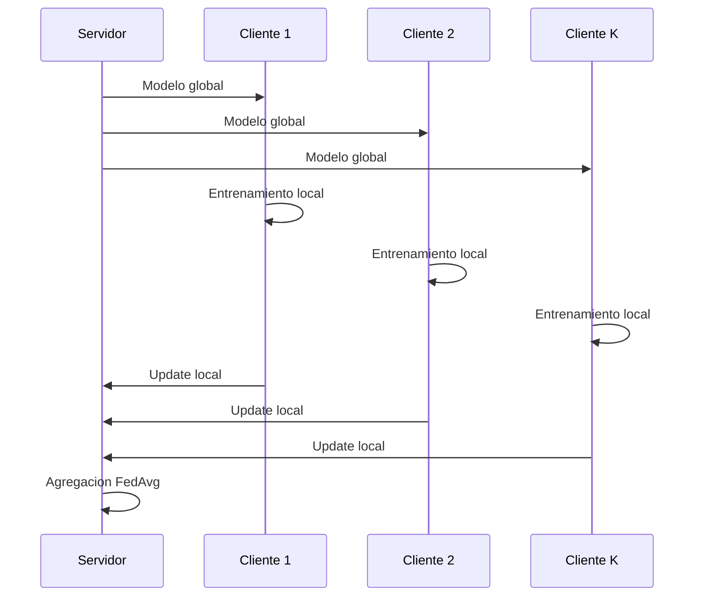

### 10.4 Factores de convergencia

- Learning rate.
- Número de epochs locales `E`.
- Heterogeneidad de datos non-IID.
- Número de clientes `K`.
- Participation rate `C`.
- Varianza de gradientes.
- Staleness de updates.
- Inconsistencias entre clientes.

### 10.5 Estrategias de agregación

FedProx:

- Añade término proximal.
- Restringe que los modelos locales se alejen demasiado del global.
- Ayuda con datos heterogéneos.

FedAdam/FedAdagrad/FedYogi:

- Adaptan optimizadores al lado servidor.

Byzantine tolerant:

- Krum: descarta outliers y elige updates cercanos al centro.
- Trimmed Mean/Median: descarta valores extremos.

### 10.6 Client selection

No todos los clientes participan siempre.

Criterios:

- Random.
- Disponibilidad.
- Recursos: CPU, batería, ancho de banda.
- Datos: cantidad/diversidad.
- Contribución al modelo.

Trade-off:

- Seleccionar clientes potentes acelera training.
- Seleccionar siempre los mismos sesga el modelo.
- Se necesita fairness y diversidad.

### 10.7 Synchronous vs asynchronous FL

Synchronous:

- El servidor espera a un conjunto de clientes.
- Más simple.
- Puede sufrir stragglers.

Asynchronous:

- El servidor actualiza según llegan updates.
- Más flexible.
- Riesgo de staleness: updates antiguos aplicados a modelos nuevos.

### 10.8 Federated traffic prediction

Aplicación:

- Cada cliente/red/localización entrena con sus medidas.
- El servidor agrega modelos.
- Se predice tráfico/carga sin compartir datos crudos.

Usos:

- Gestión proactiva.
- Prevención de fallos.
- Admission control.
- Eficiencia energética.
- Optimización de red.

---

## 11. AI/ML en estandarización Wi-Fi

### 11.1 Por qué importa la estandarización

La estandarización define:

- Reglas comunes.
- Formatos.
- Mensajes.
- Procedimientos.
- Compatibilidad.

Ventajas:

- Interoperabilidad.
- Alcance global.
- Calidad y seguridad.
- Evolución colaborativa.

IEEE 802.11 desarrolla estándares. Wi-Fi Alliance certifica interoperabilidad y productos.

### 11.2 Proceso IEEE 802.11

Fases simplificadas:

```mermaid
flowchart LR
    A["Call for interest"] --> B["TIG"]
    B --> C["Study Group"]
    C --> D["PAR"]
    D --> E["Task Group"]
    E --> F["Draft"]
    F --> G["Working Group Letter Ballot"]
    G --> H["Sponsor Ballot"]
    H --> I["RevCom"]
    I --> J["Publicacion IEEE 802.11"]
    J --> K["Certificacion Wi-Fi Alliance"]
```

### 11.3 AI/ML en IEEE 802.11

Hitos:

- Julio 2022: IEEE 802.11 establece AIML TIG.
- Marzo 2024: TIG entrega reporte de casos de uso AI/ML para Wi-Fi.
- Marzo 2024: pasa a Standing Committee.

Casos de uso:

- CSI feedback compression.
- AI/ML-based roaming.
- DRL-based channel access.
- ML-driven Multi-AP Coordination.
- AI/ML model sharing.
- Wi-Fi sensing.
- Over-the-air computation para FL.

### 11.4 CSI feedback compression

Problema:

- Beamforming necesita CSI.
- Sounding y feedback ocupan airtime.
- Con Wi-Fi 7/8, más streams y multi-AP pueden aumentar overhead.

ML:

- Autoencoders comprimen CSI.
- Reducen feedback.
- Mantienen suficiente calidad para beamforming.

Coste:

- Complejidad.
- Entrenamiento.
- Interoperabilidad.
- Cómo compartir/actualizar modelos.

### 11.5 Enhanced roaming

Problema:

- En redes densas, roaming puede ser lento.
- Escanear demasiados APs aumenta latencia.

ML:

- Predecir probabilidad de roaming hacia APs.
- Reducir lista de vecinos 802.11k.
- Guiar al cliente hacia mejores candidatos.

Beneficio:

- Menos tiempo de scanning.
- Menor latencia.
- Mejor QoE.

### 11.6 DRL-based channel access

Problema:

- CSMA/CA puede ser ineficiente e injusto en escenarios heterogéneos/densos.
- Hay slots vacíos y slots con colisiones.

ML:

- Aprender política transmit/no transmit.
- Ajustar acceso según entorno.
- Mejorar eficiencia espectral.

Riesgo:

- Complejidad.
- Estabilidad.
- Fairness entre dispositivos.
- Compatibilidad con legacy.

### 11.7 Multi-AP Coordination

Problema:

- Redes densas sufren interferencia co-canal.
- Multi-AP coordination intenta que APs cooperen.

ML:

- Seleccionar grupos no colisionantes.
- Pairing para transmisiones coordinadas.
- Mejorar uso de recursos y fairness.

### 11.8 Wi-Fi sensing

Wi-Fi sensing usa señales Wi-Fi para percibir el entorno.

Variables:

- CSI.
- RSSI.
- Packet arrival time.

Fenómenos:

- Reflexión.
- Absorción.
- Difracción.
- Multipath.

Aplicaciones:

- Detección de presencia.
- Gestos.
- Movimiento.
- Caídas.
- Respiración/ritmo cardíaco.
- Intrusión.
- Through-wall sensing.

ML ayuda a interpretar variaciones complejas de señal.

### 11.9 Over-the-air computation

OAC usa la superposición de señales inalámbricas para computar agregaciones, por ejemplo promedios de gradientes en FL.

Idea:

- Varios STAs transmiten simultáneamente.
- El canal suma señales.
- El AP recibe una agregación física.

Potencial:

- Menos overhead.
- Agregación más rápida.

Retos:

- Sincronización.
- Scheduling.
- Power control.
- CFO, Carrier Frequency Offset.
- Preambles y pilotos para estimar/compensar desalineamientos.

---

## 12. Seminarios y aplicaciones del recap

Aunque los PDFs principales son de teoría, el recap menciona aplicaciones tipo seminario/lab que ayudan a entender cómo se evalúa la asignatura.

### 12.1 Regresión lineal para performance prediction

Hipótesis:

```text
y = h_theta(x) = theta^T x = theta_0 + theta_1 x_1 + ... + theta_n x_n
```

Coste least squares:

```text
J(theta) = (1/2) sum_i (h(x_i) - y_i)^2
```

Features Wi-Fi posibles:

- Número de STAs.
- Load.
- Tamaño de escenario x/y.
- Área.
- CW.
- Channel width.
- Packet size.
- RSSI min/avg/max.

Labels:

- Throughput.
- Delay.

### 12.2 SVM

SVM busca separar clases maximizando margen.

Modelo:

```text
w^T x + b
```

Optimización hard-margin:

```text
min (1/2)||w||^2
s.t. y_i(w^T x_i + b) >= 1
```

Útil para clasificación con frontera clara; con kernels puede capturar no linealidades.

### 12.3 Clustering para Wi-Fi fingerprinting

Wi-Fi fingerprinting:

- Técnica de localización indoor.
- Usa RSSI medido desde varios APs.

Fases:

1. Offline:
   - medir RSSI en Reference Points;
   - construir modelo.

2. Online:
   - nueva lectura RSSI;
   - estimar ubicación/cluster.

Modelos:

- K-means.
- KNN.
- NN.

### 12.4 Congestion prediction supervisado

Objetivo:

- Detectar congestión en Wi-Fi.

Datos:

- Histogramas y variables agregadas.
- Labels de congestión o rendimiento.

Modelos:

- Regresión lineal.
- MLP.
- Clasificadores.

### 12.5 RL-driven channel selection

Formulación:

- Acción: elegir mejor canal de 20 MHz en OBSS.
- Reward: throughput, delay, airtime, número de TXOPs.
- Algoritmos: MAB o Q-learning.

---

## 13. Fórmulas clave

### Wi-Fi / comunicaciones

Capacidad conceptual:

```text
Capacity = Streams x Bandwidth x log(1 + SNR)
```

dBm:

```text
P[dBm] = 10 log10(P[mW])
P[mW] = 10^(P[dBm]/10)
```

Potencia recibida:

```text
P_rx[dBm] = P_tx[dBm] - PL[dB]
```

Backoff:

```text
BO in [0, CW]
E[BO] = CW/2
```

### Normalización

Min-Max:

```text
x' = (x - min(x)) / (max(x) - min(x))
```

Z-score:

```text
x' = (x - mu) / sigma
```

### Loss / métricas

MSE:

```text
MSE = (1/n) sum_i (y_i - y_hat_i)^2
```

MAE:

```text
MAE = (1/n) sum_i |y_i - y_hat_i|
```

PSNR:

```text
PSNR = 10 log10(MAX^2 / MSE)
```

Si los datos están normalizados a `[0,1]`, `MAX = 1`.

### RL

Value:

```text
V_pi(s) = E_pi[return | s]
```

Q-value:

```text
Q_pi(s,a) = E_pi[return | s,a]
```

Q-learning:

```text
Q(s_t,a_t) <- Q(s_t,a_t) + alpha [ r_t + gamma max_a Q(s_{t+1},a) - Q(s_t,a_t) ]
```

### MAB

Reward acumulado:

```text
S(T) = sum_{t=1}^T r(t)
```

Regret:

```text
R(T) = sum_{t=1}^T (mu* - r(t))
```

UCB:

```text
UCB_i = mu_hat_i + sqrt(2 ln(t) / N_i)
```

### Series temporales

Trend lineal:

```text
Y_t = beta_0 + beta_1 t + epsilon_t
```

Differencing:

```text
Delta Y_t = Y_t - Y_{t-1}
```

### Federated Learning

Objetivo:

```text
min_omega F(omega) = sum_k (|D_k|/|D|) F_k(omega)
```

FedAvg:

```text
omega(t+1) = sum_k (n_k/n_total) omega_k(t+1)
```

---

## 14. Preguntas tipo examen y respuestas rápidas

### Wi-Fi

1. Qué banda es común en Wi-Fi?  
   2.4 GHz, también 5/6 GHz en generaciones modernas.

2. Por qué 5 GHz puede ofrecer más velocidad que 2.4 GHz?  
   Porque hay más ancho de banda disponible y menos interferencia potencial, no solo porque la frecuencia sea numéricamente mayor.

3. Qué significa SSID?  
   Service Set Identifier: nombre de la red visible por el usuario.

4. Qué tecnología permite dividir canal en subcanales para usuarios distintos?  
   OFDMA.

5. Qué significa ortogonalidad en OFDM?  
   Que las subportadoras se solapan de forma controlada: el pico de una coincide con nulos de otras, permitiendo separarlas en recepción.

6. Por qué Wi-Fi usa backoff aleatorio?  
   Para reducir transmisiones simultáneas y colisiones en un medio compartido.

7. Qué pasa si CW es demasiado bajo?  
   Acceso agresivo, menor espera, más colisiones.

8. Qué pasa si CW es demasiado alto?  
   Menos colisiones, pero más delay y posible infrautilización.

### ML workflow

9. Diferencia entre supervised y unsupervised.  
   Supervised usa labels; unsupervised busca estructura sin labels.

10. Cuándo usar split cronológico?  
    En series temporales, para evitar entrenar con el futuro.

11. Qué es overfitting?  
    Buen rendimiento en train, mal en datos no vistos.

12. Por qué normalizar?  
    Para comparar escalas y mejorar optimización/convergencia.

### RL y MAB

13. Trade-off central en MAB.  
    Exploration vs exploitation.

14. Qué es regret?  
    Pérdida acumulada frente a un oráculo que elige siempre la mejor acción.

15. Qué representa el confidence term en UCB?  
    Incertidumbre por pocas muestras del brazo.

16. Qué hace epsilon-greedy?  
    Explora al azar con probabilidad epsilon y explota el mejor estimado con `1-epsilon`.

17. Por qué epsilon decreciente?  
    Para explorar al principio y explotar más cuando ya hay conocimiento.

18. Qué es Q-learning?  
    Algoritmo model-free que aprende valores acción-estado para derivar una política.

19. Qué son alpha y gamma?  
    Alpha es learning rate; gamma descuenta recompensa futura.

20. Por qué discretizar SINR en Q-learning clásico?  
    Porque la Q-table necesita estados discretos.

### Resource allocation

21. Qué recursos se asignan en Wi-Fi?  
    Frecuencia, tiempo y espacio, que determinan airtime y rendimiento.

22. Qué parámetros controla EDCA?  
    CW, AIFS y TXOP para Access Categories.

23. Qué efecto tiene subir CCA/SD threshold?  
    Menos contención y más transmisiones simultáneas, pero más interferencia.

24. Por qué puede ser malo que cada AP maximice su reward individual?  
    Puede producir un equilibrio no cooperativo con interferencia excesiva y menor rendimiento global.

### Deep Learning

25. Por qué un perceptrón no aprende XOR?  
    Porque XOR no es linealmente separable.

26. Qué es forward propagation?  
    Paso de inputs por capas hasta obtener `y_hat`.

27. Qué es backpropagation?  
    Cálculo de gradientes de la loss para actualizar pesos.

28. Qué problema causa vanishing gradient?  
    Gradientes demasiado pequeños impiden actualizar capas tempranas.

29. Cómo ayuda dropout?  
    Desactiva aleatoriamente neuronas durante training y fuerza robustez.

30. Para qué sirve un autoencoder en Wi-Fi?  
    Comprimir CSI o feedback reduciendo overhead.

### Series temporales y FL

31. Qué es stationarity?  
    Media, varianza y autocovarianza estables en el tiempo.

32. Qué hace differencing?  
    Resta valores consecutivos para eliminar trend.

33. Cuándo usar ARIMA?  
    Series estacionarias/estacionarizables, forecast corto, interpretabilidad.

34. Ventaja de LSTM frente a RNN simple.  
    Maneja mejor dependencias largas y vanishing gradient.

35. Qué es FedAvg?  
    Agregación ponderada de modelos/updates locales para crear modelo global.

36. Problemas principales de FL.  
    Non-IID, clientes offline, staleness, comunicación, seguridad de updates.

### Estandarización

37. Qué rol tiene IEEE 802.11?  
    Desarrolla y mantiene el estándar WLAN.

38. Qué rol tiene Wi-Fi Alliance?  
    Certifica interoperabilidad de productos.

39. Casos AI/ML en Wi-Fi standardization.  
    CSI compression, roaming, DRL channel access, MAPC, sensing, model sharing, OAC.

40. Qué reto tiene OAC?  
    Sincronizar transmisiones y compensar CFO para que las señales se sumen coherentemente.

---

## 15. Tabla de decisión: qué modelo usar

| Problema | Datos | Modelo inicial | Modelo avanzado | Métrica |
|---|---|---|---|---|
| Throughput prediction | tabular | regresión lineal / RF | MLP | MSE/MAE |
| Congestion detection | histogramas/KPIs | logistic regression | MLP/CNN | accuracy/F1 |
| AP load forecasting | serie temporal | ARIMA | LSTM/Transformer | MAE/RMSE |
| Channel selection | reward por canal | epsilon-greedy | UCB/Thompson/Q-learning | regret/throughput |
| MCS selection | SINR/PER | tabla heurística | Q-learning/DQN | throughput/PER |
| Spatial reuse | CCA, power, interferencia | MAB | multi-agent RL | PF/fairness/throughput |
| CSI compression | matrices CSI | PCA | autoencoder | MSE/PSNR/beamforming |
| Roaming | RSSI, movilidad, APs | reglas/RSSI | GNN/SL | latency/QoE |
| Federated traffic prediction | datos distribuidos | central baseline | FedAvg/FedProx | MAE + privacidad |

---

## 16. Errores típicos que conviene evitar

- Confundir SSID con BSSID: SSID es nombre; BSSID identifica un BSS concreto.
- Decir que 5 GHz es más rápido "porque 5 > 2.4": la razón importante es más ancho disponible y menos congestión potencial.
- Confundir OFDM con OFDMA: OFDMA reparte subportadoras entre usuarios.
- Pensar que mayor potencia siempre mejora la red: puede aumentar interferencia y contención.
- Usar random split en series temporales: puede filtrar futuro al entrenamiento.
- Evaluar hiperparámetros con test set: contamina la evaluación.
- Creer que RL siempre es mejor: puede ser inestable, costoso y peligroso en redes reales.
- Usar epsilon constante y esperar regret sublineal.
- Optimizar reward individual en multi-AP y esperar óptimo global.
- Olvidar que FL no elimina todos los riesgos de privacidad: updates pueden filtrar información si no hay protecciones.

---

## 17. Mini plan de repaso de 7 días

| Día | Bloque | Trabajo |
|---:|---|---|
| 1 | Wi-Fi PHY/MAC | Rehacer mapa de PHY/MAC, DCF, OFDM/OFDMA, MIMO y MCS |
| 2 | ML workflow | Memorizar pipeline y practicar formulaciones problema-datos-métrica |
| 3 | RL/MAB | Escribir Q-learning, UCB, epsilon-greedy y comparar algoritmos |
| 4 | Resource allocation | Resolver mentalmente canal, EDCA y spatial reuse como problemas ML |
| 5 | Deep Learning | Repasar forward/backprop, losses, activations, overfitting/dropout |
| 6 | Time series/FL | ARIMA vs LSTM/CNN/Transformer, FedAvg y client selection |
| 7 | Standardization + test | Casos AI/ML en 802.11, preguntas tipo test, fórmulas |

### Rutina de cada sesión

1. 20 min: leer apuntes del bloque.
2. 20 min: escribir de memoria fórmulas/diagramas.
3. 20 min: responder preguntas rápidas.
4. 10 min: apuntar dudas.
5. 10 min: repetir solo lo fallado.

---

## 18. Resumen final de una página

Wi-Fi funciona en espectro no licenciado, por lo que debe coordinar transmisiones mediante escucha del canal, backoff aleatorio y retransmisiones. Su rendimiento depende de ancho de banda, streams espaciales y SNR/SINR, y se complica por interferencias, movilidad, densidad y coexistencia.

Machine Learning entra cuando las reglas cerradas son insuficientes: predicción de carga, selección de AP/canal/MCS, spatial reuse, CSI compression, roaming y coordinación multi-AP. El workflow correcto empieza formulando el problema, no eligiendo modelo.

En supervised learning se aprende `x -> y`; en unsupervised se descubre estructura; en RL se aprende una política mediante rewards. Los bandits son el caso de decisión repetida con feedback parcial y sin estado complejo; su concepto central es exploration-exploitation y se evalúan con regret.

Q-learning actualiza `Q(s,a)` combinando reward inmediato y mejor valor futuro. En Wi-Fi se usa para MCS, canal o spatial reuse, pero debe cuidarse la exploración porque afecta a usuarios reales.

Resource allocation reparte frecuencia, tiempo y espacio. EDCA prioriza tráfico usando CW, AIFS y TXOP. Spatial reuse ajusta CCA/OBSS-PD y potencia: ser agresivo puede mejorar throughput propio y empeorar el global.

Deep Learning permite aproximar funciones complejas: MLP para datos tabulares, CNN para patrones locales/mapas, RNN/GRU/LSTM para secuencias, Transformers para dependencias largas y Autoencoders para compresión.

Time series forecasting exige respetar orden temporal, analizar stationarity, trend y seasonality. ARIMA es interpretable y útil si estacionarizas; LSTM/CNN/Transformer son más flexibles pero más costosos.

Federated Learning entrena sin centralizar datos: los clientes entrenan localmente y el servidor agrega. FedAvg es la base, pero aparecen retos de non-IID, selección de clientes, staleness y seguridad.

La estandarización Wi-Fi ya estudia AI/ML: CSI compression, roaming, DRL channel access, MAPC, sensing, model sharing y over-the-air computation. El gran tema transversal es siempre el mismo: rendimiento vs overhead, complejidad, fairness, privacidad e interoperabilidad.
